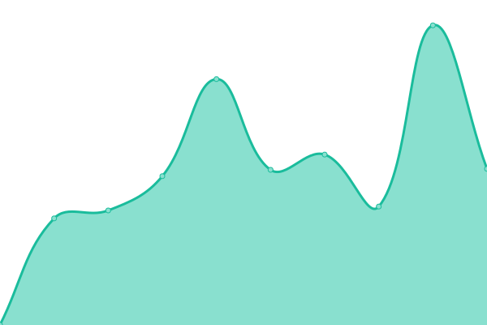
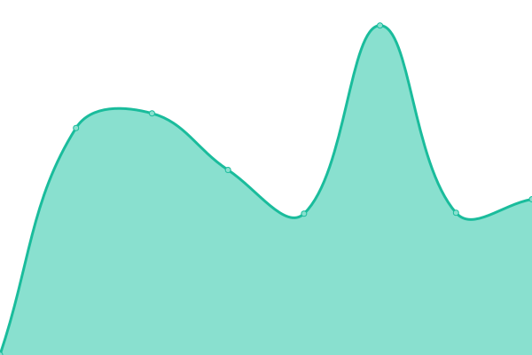

# [📈 Live Status](https://m-team-kit.github.io/status-ai): <!--live status--> **🟩 All systems operational**

This repository contains the open-source uptime monitor and status page for [m-team-kit](https://m-team-kit.github.io/status-ai), powered by [Upptime](https://github.com/upptime/upptime).

With [Upptime](https://upptime.js.org), you can get your own unlimited and free uptime monitor and status page, powered entirely by a GitHub repository. We use [Issues](https://github.com/m-team-kit/status-ai/issues) as incident reports, [Actions](https://github.com/m-team-kit/status-ai/actions) as uptime monitors, and [Pages](https://m-team-kit.github.io/status-ai) for the status page.

<!--start: status pages-->
<!-- This summary is generated by Upptime (https://github.com/upptime/upptime) -->
<!-- Do not edit this manually, your changes will be overwritten -->
<!-- prettier-ignore -->
| URL | Status | History | Response Time | Uptime |
| --- | ------ | ------- | ------------- | ------ |
|  [Software template generator (UI) (Templates Hub)](https://templates.services.fedcloud.eu/) | 🟩 Up | [software-template-generator-ui-templates-hub.yml](https://github.com/m-team-kit/status-ai/commits/HEAD/history/software-template-generator-ui-templates-hub.yml) | 

 994ms
     
 | 

<a href="https://m-team-kit.github.io/status-ai/history/software-template-generator-ui-templates-hub">100.00%</a>
    

|  [Software template generator (API) (Templates Hub)](https://templates.services.fedcloud.eu/api/latest/docs) | 🟩 Up | [software-template-generator-api-templates-hub.yml](https://github.com/m-team-kit/status-ai/commits/HEAD/history/software-template-generator-api-templates-hub.yml) | 

 141ms
     
 | 

<a href="https://m-team-kit.github.io/status-ai/history/software-template-generator-api-templates-hub">100.00%</a>
    

|  [AI repository template generator (UI) (AI4EOSC)](https://templates.cloud.ai4eosc.eu/) | 🟩 Up | [ai-repository-template-generator-ui-ai-4-eosc.yml](https://github.com/m-team-kit/status-ai/commits/HEAD/history/ai-repository-template-generator-ui-ai-4-eosc.yml) | 

 1262ms
     
 | 

<a href="https://m-team-kit.github.io/status-ai/history/ai-repository-template-generator-ui-ai-4-eosc">100.00%</a>
    

|  [MLflow UI (AI4EOSC)(Prod)](https://mlflow.cloud.ai4eosc.eu/) | 🟩 Up | [m-lflow-ui-ai-4-eosc-prod.yml](https://github.com/m-team-kit/status-ai/commits/HEAD/history/m-lflow-ui-ai-4-eosc-prod.yml) | 

 1026ms
     
 | 

<a href="https://m-team-kit.github.io/status-ai/history/m-lflow-ui-ai-4-eosc-prod">100.00%</a>
    

|  [MLflow UI (iMagine)(Prod)](https://mlflow.cloud.imagine-ai.eu/) | 🟩 Up | [m-lflow-ui-i-magine-prod.yml](https://github.com/m-team-kit/status-ai/commits/HEAD/history/m-lflow-ui-i-magine-prod.yml) | 

 1197ms
     
 | 

<a href="https://m-team-kit.github.io/status-ai/history/m-lflow-ui-i-magine-prod">100.00%</a>
    

|  [MLflow UI (SCC)(Prod)](https://mlflow.scc.kit.edu/) | 🟩 Up | [m-lflow-ui-scc-prod.yml](https://github.com/m-team-kit/status-ai/commits/HEAD/history/m-lflow-ui-scc-prod.yml) | 

 722ms
     
 | 

<a href="https://m-team-kit.github.io/status-ai/history/m-lflow-ui-scc-prod">100.00%</a>
    

<!--end: status pages-->

[**Visit our status website →**](https://m-team-kit.github.io/status-ai)

## 📄 License

- Powered by: [Upptime](https://github.com/upptime/upptime)
- Code: [MIT](./LICENSE) © [m-team-kit](https://m-team-kit.github.io/status-ai)
- Data in the `./history` directory: [Open Database License](https://opendatacommons.org/licenses/odbl/1-0/)
