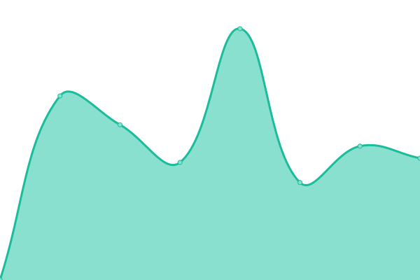

# [📈 Live Status](https://m-team-kit.github.io/templates-status): <!--live status--> **🟩 All systems operational**

This repository contains the open-source uptime monitor and status page for [m-team-kit](https://m-team-kit.github.io/templates-status), powered by [Upptime](https://github.com/upptime/upptime).

With [Upptime](https://upptime.js.org), you can get your own unlimited and free uptime monitor and status page, powered entirely by a GitHub repository. We use [Issues](https://github.com/m-team-kit/templates-status/issues) as incident reports, [Actions](https://github.com/m-team-kit/templates-status/actions) as uptime monitors, and [Pages](https://m-team-kit.github.io/templates-status) for the status page.

<!--start: status pages-->
<!-- This summary is generated by Upptime (https://github.com/upptime/upptime) -->
<!-- Do not edit this manually, your changes will be overwritten -->
<!-- prettier-ignore -->
| URL | Status | History | Response Time | Uptime |
| --- | ------ | ------- | ------------- | ------ |
|  [AI repository template generator (WebApp)](https://templates.cloud.ai4eosc.eu/) | 🟩 Up | [ai-repository-template-generator-web-app.yml](https://github.com/m-team-kit/templates-status/commits/HEAD/history/ai-repository-template-generator-web-app.yml) | 

 823ms
     
 | 

<a href="https://m-team-kit.github.io/templates-status/history/ai-repository-template-generator-web-app">100.00%</a>
    

|  [AI repository template generator (API)](https://templates.cloud.ai4eosc.eu/api/v1/) | 🟩 Up | [ai-repository-template-generator-api.yml](https://github.com/m-team-kit/templates-status/commits/HEAD/history/ai-repository-template-generator-api.yml) | 

 116ms
     
 | 

<a href="https://m-team-kit.github.io/templates-status/history/ai-repository-template-generator-api">100.00%</a>
    

<!--end: status pages-->

[**Visit our status website →**](https://m-team-kit.github.io/templates-status)

## 📄 License

- Powered by: [Upptime](https://github.com/upptime/upptime)
- Code: [MIT](./LICENSE) © [m-team-kit](https://m-team-kit.github.io/templates-status)
- Data in the `./history` directory: [Open Database License](https://opendatacommons.org/licenses/odbl/1-0/)
